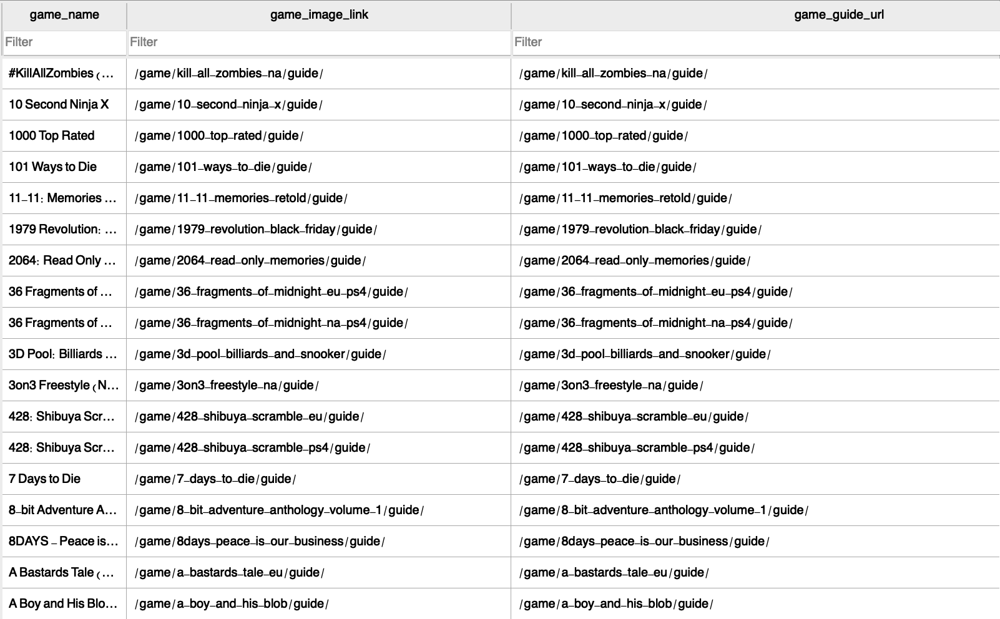
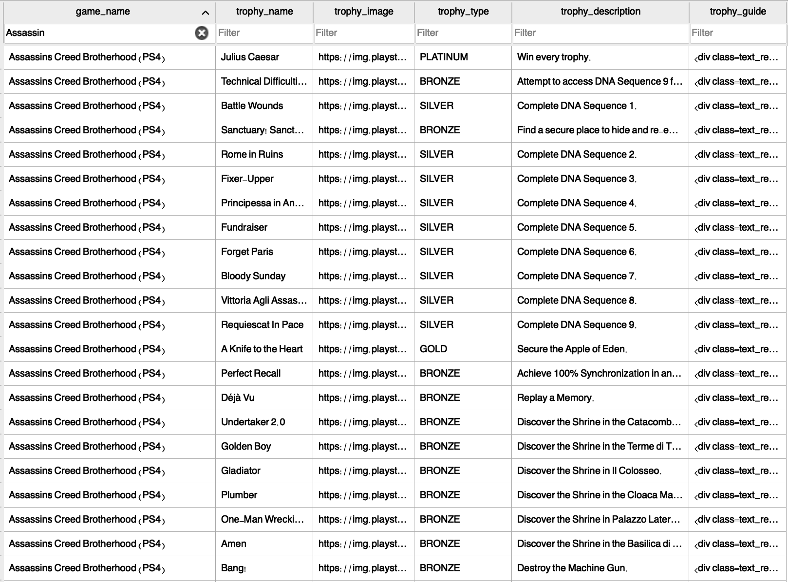

# PSN-Trophy-Data-Scraper
Python script that scrapes game and trophy detail from the site https://www.playstationtrophies.org/games/ps4/. It then creates two SQLITE database that contains the scraped details.

Database with game name and the guide link and the image link:

Database with game name, trophy name, trophy image, trophy type, trophy description and trophy guide:

